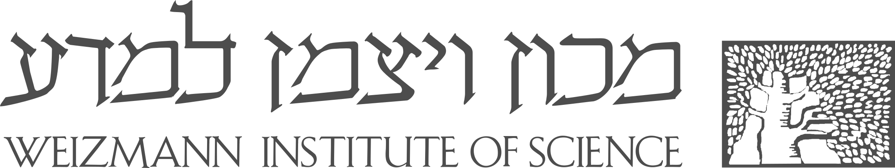

<b> Contact </b>

  

<b>Feature Request/Bug Report</b>

To report bugs or request new features of ShinyCardinal, please send an email to:

[Dr.Yonghui Dong <i class="fa fa-envelope-o fa-xl" aria-hidden="true"></i>](mailto:yonghui.dong@gmail.com) or [Dr.Uwe Heinig <i class="fa fa-envelope-o fa-xl" aria-hidden="true"></i>](mailto:Uwe.Heinig@weizmann.ac.il)

<b>Cardinal Support</b>

R package Cardinal includes a walkthrough vignette that showcases both its fundamental and advanced features. To learn more about Cardinal, please read [here](https://bioconductor.org/packages/release/bioc/html/Cardinal.html) and [here](https://bioconductor.org/packages/release/data/experiment/html/CardinalWorkflows.html).

If you need any help, please visit [Cardinal google help group](https://groups.google.com/g/CardinalMSI?hl=en).

<b>Please Cite</b>

If you use ShinyCardinal, please cite the following references:

> <b>1</b>. Dong.Y., and Heinig, W., 2024. Mass Spectrometry Imaging Data Analysis with ShinyCardinal.
>
> <b>2</b>. Bemis, K.A., Foell, M.C., Guo, D., Lakkimsetty, S.S., and Vitek, O., 2023. Cardinal v.3: a versatile open-source software for mass spectrometry imaging analysis. **Nature Methods**, 20, 1883-1886. <a href="https://doi.org/10.1038/s41592-023-02070-z" target="_new"><i class="fa fa-link" aria-hidden="true"></i></i></a>
> 

<b>Software Version Info</b>

> Cardinal: 3.5.0 
> 
> CardinalIO: 1.1.1 
> 
> ShinyCardinal: 0.3.1
> 
> R version: 4.3.2

---

  
