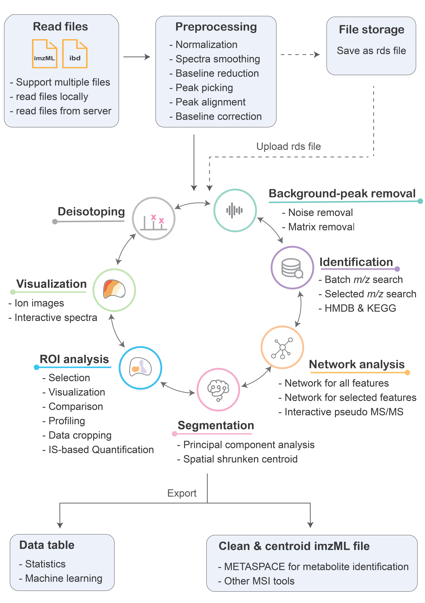

<b>𓅫 Welcome to ShinyCardinal (v0.2.2)</b>

  

Mass spectrometry imaging (MSI) is a well-established analytical technique that allows direct mapping of a wide variety of chemical classes from different biological samples, providing information concerning analyte identity, relative abundance, and spatial distribution.

<b>ShinyCardinal</b> is the web application, built on the basis of the R package <a href="https://cardinalmsi.org" target="_new">Cardinal</a>. Alongside incorporating most of the existing features in Cardinal, ShinyCardinal has also introduced many additional functions (Fig.1). It is designed to aid researchers in reading, processing, visualizing and analyzing their MSI data. With its structured and intuitive workflow, ShinyCardinal offers a flexible and user-friendly tool suitable for users of all levels.

---

<b>Workflow</b>

Fig. 1 Workflow and main features of ShinyCardinal.

  

<b>Main Features</b>

- Cross platform.

- Vendor neutral: accept imzML format.

- Accept multiple MSI data (runs).

- MSI data pre-processing, including normalization, smoothing, baseline correction, peak-picking and alignment.

- Background noise and matrix peaks removal.

- Visualization of mass spectra and molecular ion images

- Region of interest (ROI) analysis, including ROI selection, visualization, comparison (statistics) and profiling.

- Internal standard based-quantification (qMSI)

- Image segmentation using principal component analysis (PCA) and spatial shrunken centroid (SSC).

- Network analysis, colocalization analysis, and pseudo-MS/MS generation.

- Metabolite identification.

<b>How to use ShinyCardinal</b>

ShinyCardinal accept imzML format as input. Please read the <a href="https://docs.google.com/document/d/e/2PACX-1vTT4QrMQ2RJMjziscaU8S3gbznlv6Rm5ojwrsdAXPbR5bt7Ivp-ThkC0hefrk3ZdVqiyCX7VU_ddA62/pub" target="_new">user guide</a> provided by METASPCE regarding how to convert raw MSI data into imzML format. 

Please note that ShinyCardinal accepts both profile mode and centroid mode, as well as processed and continuous imzML files. To understand the difference between profiled and centroid mode, and processed and continuous files, please kindly refer to <a href="https://doi.org/10.1016/j.jprot.2012.07.026" target="_new">this publication</a>.

Using ShinyCardinal is straightforward. Simply follow the step-by-step instructions provided in each tab to perform your data analysis. 

For further guidance, please watch the tutorial videos. <a href="https://www.youtube.com/@MSI_WIS/videos" target="_new"><i class="fa fa-youtube"></i></a>

<b>Demo data</b>

You can use the following demo data sets to get familiar with ShinyCardinal.

Please note that the RDS format data refers to the preprocessed imzML data, which has undergone normalization, peak picking, and peak alignment using ShinyCardinal. As a result, this data is significantly cleaner and smaller in size. 

Please note that the following data sets are distributed under the <a href="https://creativecommons.org/licenses/by/4.0/" target="_new">CC BY 4.0 license</a>. If you intend to use any of them in your publication or other work, please ensure to give proper credit to the authors.

<b>Data Set 1: MALDI Imaging</b>

> <b>Description</b>: Brain tissue was dissected from euthanised mouse. MALDI imaging was performed in positive ion mode over an m/z range of 300 – 2000 using a Thermo MALDI LTQ Orbitrap XL instrument. The spatial resolution was 50 μm. Raw data, in profile mode, was converted to mzML format using ProteoWizard, and then to imzML format using imzMLConverter.
>
> <b>Credit</b>: Bond, Nicholas J., Albert Koulman, Julian L. Griffin, and Zoe Hall. "massPix: an R package for annotation and interpretation of mass spectrometry imaging data for lipidomics." Metabolomics 13 (2017): 1-5.
>
> <b>Download Link</b>: (1) imzML format <a href="https://www.ebi.ac.uk/metabolights/editor/MTBLS487/descriptors" target="_new"><i class="fa fa-link" aria-hidden="true"></i></i></a>; (2) RDS format <a href="https://www.dropbox.com/s/cgdzhsmrzs2rnhh/MALDI_Mouse2Brains.rds?dl=0" target="_new"><i class="fa fa-link" aria-hidden="true"></i></i></a>
>
> <b>Note</b>: 
> 

<b>Data Set 2: AP-MALDI Imaging</b>

> <b>Description</b>: Mouse urinary bladder sections were scanned by MS with 10 μm spatial resolution with a AP-SMALDI. MS imaging data was converted to imzML format using the 'RAW to imzML' converter.
>
> <b>Credit</b>: Römpp, Andreas, Sabine Guenther, Yvonne Schober, Oliver Schulz, Zoltan Takats, Wolfgang Kummer, and Bernhard Spengler. "Histology by mass spectrometry: label‐free tissue characterization obtained from high‐accuracy bioanalytical imaging." Angewandte chemie international edition 49, no. 22 (2010): 3834-3838.
>
> <b>Download Link</b>: (1) imzML format <a href="https://www.ebi.ac.uk/pride/archive/projects/PXD001283" target="_new"><i class="fa fa-link" aria-hidden="true"></i></i></a>; (2) RDS format <a href="https://www.dropbox.com/s/lclimkantn52plq/MALDI_MouseUrinaryBladder.rds?dl=0" target="_new"><i class="fa fa-link" aria-hidden="true"></i></i></a>
>
> <b>Note</b>: 
> 

<b>Data Set 3: DESI Imaging</b>

> <b>Description</b>: Liver samples were dissected from dult male Hans Wistar rats. DESI MSI analysis was performed using a Q-Exactive mass spectrometer operated in positive ion mode. Mass spectra were collected in the mass range of m/z 200 – 600 at a mass resolution of 140,000 (at m/z 200). Individual horizontal line scans were combined into imzML format using the imzML converter.
>
> <b>Credit</b>: Swales, John G., Nicole Strittmatter, James W. Tucker, Malcolm R. Clench, Peter JH Webborn, and Richard JA Goodwin. "Spatial quantitation of drugs in tissues using liquid extraction surface analysis mass spectrometry imaging." Scientific reports 6, no. 1 (2016): 37648.
>
> <b>Download Link</b>: (1) imzML format <a href="https://metaspace2020.eu/dataset/2016-12-09_10h16m23s" target="_new"><i class="fa fa-link" aria-hidden="true"></i></i></a>; (2) RDS format <a href="https://www.dropbox.com/s/vgi2yc0wusi9fqt/DESI_MouseLiver.rds?dl=0" target="_new"><i class="fa fa-link" aria-hidden="true"></i></i></a>
>
> <b>Note</b>:

<b>Data Set 4: SIMS Imaging</b>

> <b>Description</b>: 
>
> <b>Credit</b>: MSI unit, Weizmann Institute of Science.
>
> <b>Download Link</b>:
>
> <b>Note</b>:

---

  
